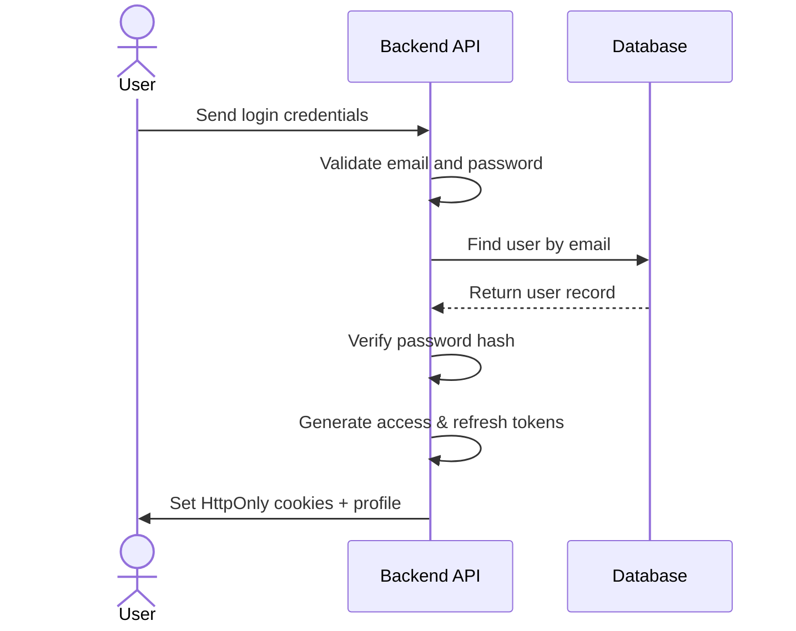
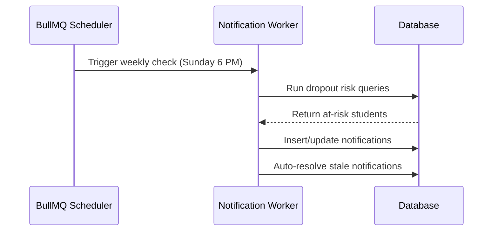
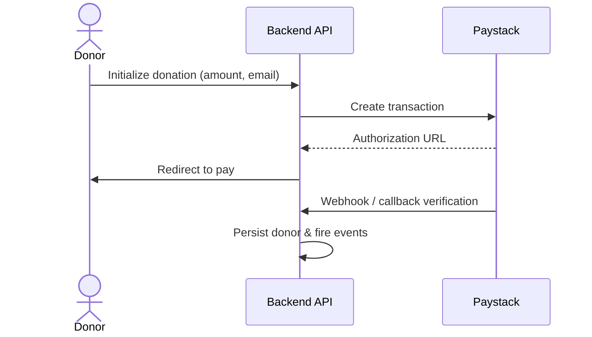
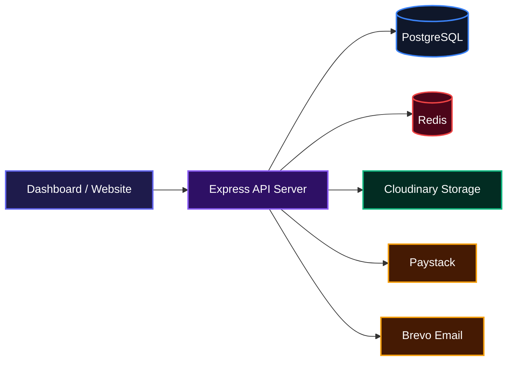

# Cedarrise Backend

The engine behind the Cedarrise Initiative’s mission — a comprehensive backend powering program management for after-school education, scholarships, capacity building, community outreach, and volunteer coordination across Nigeria. It handles everything from student registration and tracking to donation processing and automated notifications, all served through a secure API.

## Features

- **Multi‑Program Management**  
  Manage ASH, TACOTS, Capacity Building, Outreaches, and Volunteer programs through dedicated form submissions, detailed record views, and CSV exports.

- **Authentication & Role‑Based Access**  
  Cookie‑based JWT authentication with silent token refresh. Three roles (Volunteer, Admin, SuperAdmin) with fine‑grained permissions control every operation.



- **Automated Notification System**  
  A weekly BullMQ cron job scans for at‑risk students (dropout risk, low attendance, score drops) and inactive volunteers, then generates dashboard notifications that can be dismissed or auto‑resolved.



- **Donation Processing**  
  Integrates with Paystack to initialize transactions, verify payments, and persist donor records. Thank‑you emails and internal alerts are fired automatically on success.



- **Analytics Dashboard**  
  Pre‑computed metrics (cards, charts, geographical distributions) are cached and served for the admin dashboard, giving instant visibility into enrollment, performance, community service hours, and more.

- **File & Photo Management**  
  Upload passport photos, term results, receipts, gallery images, and blog documents to Cloudinary. Assets are organized by program and deleted via a BullMQ queue when records are removed.

- **Rich Search & CSV Downloads**  
  Every record list supports full‑text PostgreSQL search (weighted tsvector) and can be exported as a CSV file for offline analysis.

## System Architecture



## Usage

### Prerequisites
- Node.js 24+ and `pnpm`
- Docker and Docker Compose

### Setup

1. Clone the repository and install dependencies:
   ```bash
   git clone https://github.com/cedarrise-organization/backend.git
   cd backend
   pnpm install
   ```

2. Create a `.env` file from the provided example and fill in your credentials (PostgreSQL, Redis, Cloudinary, Paystack, Brevo, etc.).

3. Start PostgreSQL and Redis using Docker:
   ```bash
   docker compose up -d cedarrise-postgres-db cedarrise-redis
   ```

4. Run database migrations and seed:
   ```bash
   pnpm db:push
   pnpm db:seed   # optional initial data
   ```

5. Start the development server:
   ```bash
   pnpm dev
   ```
   The API will be available at `http://localhost:3000/api/v1`.

### Authentication

All protected endpoints require the `cedaraccess` HTTP‑only cookie set after a successful login. Use the following credentials for testing after seeding:

```bash
curl -X POST http://localhost:3000/api/v1/auth/login \
  -H "Content-Type: application/x-www-form-urlencoded" \
  -d "email=admin@example.com&password=12345678" \
  -c cookies.txt
```

Subsequent requests will automatically include the cookie if using `-b cookies.txt`.

### Example API Calls

**Fetch Dashboard Cards**
```bash
curl http://localhost:3000/api/v1/dashboard/cards -b cookies.txt
```

**List ASH Students (paginated and filtered)**
```bash
curl "http://localhost:3000/api/v1/forms/ash/registration?page=1&limit=25&status=pending" -b cookies.txt
```

**Download Receipts CSV**
```bash
curl -OJ http://localhost:3000/api/v1/general/download/receipts -b cookies.txt
```

Full API documentation is available in the [Bruno collection](./src/cedarrise-collection) — a collection of interactive HTTP requests that mirror every endpoint and its expected payload.

## Technologies Used

| Technology        | Purpose                          | Link                                               |
|-------------------|----------------------------------|----------------------------------------------------|
| Node.js           | Runtime                          | https://nodejs.org                                 |
| Express           | HTTP framework                   | https://expressjs.com                              |
| TypeScript        | Language                         | https://www.typescriptlang.org                     |
| PostgreSQL        | Primary database                 | https://www.postgresql.org                         |
| Drizzle ORM       | Database toolkit                 | https://orm.drizzle.team                           |
| Redis             | Caching & queue backend          | https://redis.io                                   |
| BullMQ            | Job queues                       | https://bullmq.io                                  |
| Zod               | Schema validation                | https://zod.dev                                    |
| JSON Web Token    | Authentication                   | https://jwt.io                                     |
| Cloudinary        | File uploads / CDN               | https://cloudinary.com                             |
| Brevo             | Transactional email              | https://www.brevo.com                              |
| Paystack          | Payment processing               | https://paystack.com                               |
| EJS               | Email templating                 | https://ejs.co                                     |
| json2csv          | CSV export                       | https://github.com/zemirco/json2csv                |
| Docker            | Containerisation                 | https://www.docker.com                             |

## Author

- LinkedIn: [https://linkedin.com/in/Maxmillian%20Ogbuabor](https://linkedin.com/in/Maxmillian%20Ogbuabor)
- X (Twitter): [https://x.com/KolbeTM](https://x.com/KolbeTM)

## Badges

[](https://www.typescriptlang.org/)
[](https://expressjs.com/)
[](https://www.postgresql.org/)
[](https://redis.io/)
[](https://www.docker.com/)
[](https://bullmq.io/)
